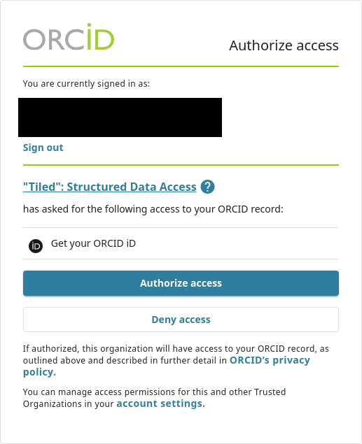

# Log into an Authenticated Tiled Server

For this tutorial, we will log in to the demo Tiled server at
`https://tiled-demo.blueskyproject.io`. This server is configured to use
[ORCID](https://orcid.org) for authentication, so you will need an ORCID
account.

From Python, connect as usual.

```python
>>> from tiled.client import from_uri
>>> c = from_uri("https://tiled-demo.blueskyproject.io/api")
```

You will see this prompt.

```
Navigate web browser to this address to obtain access code:

https://orcid.org/oauth/authorize?client_id=APP-0ROS9DU5F717F7XN&response_type=code&scope=openid&redirect_uri=https://tiled-demo.blueskyproject.io/auth/code


Access code (quotes optional):
```

Copy/paste that link into a web browser.

You will prompted to log in to ORCID, unless you are already logged in in
another browser tab.


Once you log in, you will be prompted to authorize Tiled. This enables
Tiled to confirm your identity with ORCID. It's using the same mechanism as
websites that prompt you to "Log in to ___ with Google," for example.



From here, you will be redirected to a page showing a (long!) access code. Copy
the whole thing.

Back in Python, paste it in to the prompt and press enter.
**You will not see any characters when you paste because the access code input is hidden.**

```
Navigate web browser to this address to obtain access code:

https://orcid.org/oauth/authorize?client_id=APP-0ROS9DU5F717F7XN&response_type=code&scope=openid&redirect_uri=https://tiled-demo.blueskyproject.io/auth/code


Access code (quotes optional): <--- Paste and press Enter.
```

After a couple seconds, you will see a confirmation message:

```
You have logged with ORCID as XXXX-XXXX-XXXX-XXXX.
```

and you can access data.

```
>>> c
<Node {'big_image', 'small_image', 'medium_image', ...} ~13 entries>
```

Next, quit Python and start it fresh.

```python
>>> from tiled.client import from_uri
>>> c = from_uri("https://tiled-demo.blueskyproject.io/api")
>>> c
<Node {'big_image', 'small_image', 'medium_image', ...} ~13 entries>
```

Notice that you are _not_ prompted to log in again. The login process
stashed a file (under `~/.config/tiled/tokens/tiled-demo.blueskyproject.io/`)
that enables the session to be reused. It expires if unused for some period. By
default it expires after one week of disuse, but this is configurable and can
vary from one Tiled server to another.

Now log out via:

```
>>> c.context.logout()
```

This removes the stashed file.

The tiled commandline interface provides utilities to log in, log out,
and list active sessions. Try the following.

```
$ tiled login https://tiled-demo.blueskyproject.io/api
...

$ tiled logout https://tiled-demo.blueskyproject.io/api
tiled-demo.bluesky.project.io

$ tiled login https://tiled-demo.blueskyproject.io/api
...

$ tiled sessions  # List active sessions.
tiled-demo.bluesky.project.io

$ tiled logout  # Log out of *all* sessions and list them.
tiled-demo.bluesky.project.io
```

This Tiled server is configured so that login is required, but once logged in,
anyone with an ORCID can see the data. Other Tiled servers are configured to
restrict access to a specific list of ORCIDs. To learn how to _deploy_
authenticated Tiled servers, see {doc}`../explanations/security`.
